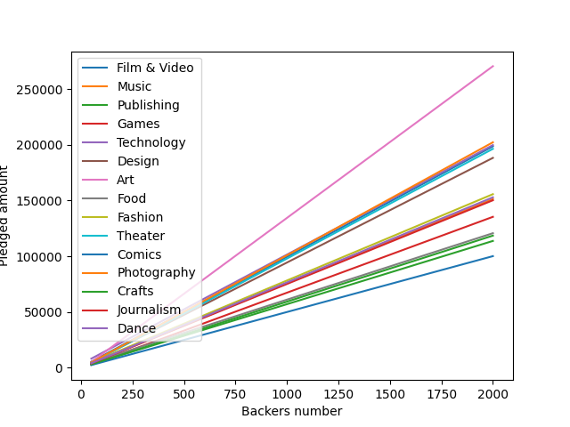

# traitement-info
Analyse d'une base de données sur les incendies en forêt dans le cadre du module Traitement de l'informatique

`pip install -r requirements.txt` pour installer les dépendances.

"encodage de variables catégorielles" nb

1. Avec pour goal=50 000, catégorie = Film & Video, pays = US, monnaie = USD et temps = 30 j
Le modèle prédit une réussite de la campagne avec 576 backers

Problème du fléau des dimensions
Sous apprentissage
Données non nettoyées

On veut prédire la somme que l'on va obtenir et ainsi maximiser le succès de la campagne

-> Regression linéaire, toujours avec deux variables et on trie les autres afin de faire des comparaisons sinon trop de variables

On fixe un goal, on incrémente les backers et on regarde pour chaque monnaie le nombre de backers qu'il nous faut pour atteindre le goal
On remarque que les monnaies les plus efficaces sont : GBP, MXN, NOK, DDK et SEK

| Nombre de projet | Monnaie |
| ---------------- | ------- |
| 176076           | USD     |
| 19340            | GBP     |
| 8706             | CAD     |
| 4507             | AUD     |
| 8319             | EUR     |
| 929              | SEK     |
| 150              | MXN     |
| 813              | NZD     |
| 617              | DKK     |
| 399              | NOK     |
| 345              | CHF     |
| 68               | HKD     |
| 84               | SGD     |

La conclusion sur la monnaie GBP est particulièrement intéressante car elle est la monnaie la plus utilisée en dehors des USA et elle est la plus efficace pour atteindre le goal avec le moins de backers

On va maintenant dans les projets utilisant la monnaie GBP, on va regarder le temps le plus optimal pour atteindre le goal

Valeurs moyennes pour les projets utilisant la monnaie GBP

Objectif moyen: 32805 GBP
Somme récoltée moyenne: 2779 GBP
Nombre de backers moyen: 46

Avec ces données que l'on peut calculer mathématiquement nous allons essayer de savoir quel est la catégorie de projet la plus efficace :

Nous pouvons voir que l'Art est la catégorie la plus efficace pour atteindre le goal avec le moins de backers plus loins se talonnent les catégories Technology, Musique, Film & Video, le Théâtre et le design.

Maintenant nous allons faire une regression linéaire pour essayer de prédire le nombre de backers nécessaire et le goal à attribuer en fonction
de la somme récoltée. En se plaçant avec la monnaie GBP et avec une catégorie Art. Echantillon de 10 000 projets. Donc ces critères permettent de réduire le nombre de données à traiter et donc utiliser des algorithmes plus efficaces.

à part :
On peut s'amuser à obtenir des moyennes à partir de critère ici Moyenne des projets en design avec comme currency l'euro :
{'goal ': 33086, 'pledged ': 15942, 'backers ': 123 } si on l'on prend en compte que les projets réussi sinon :
{'goal ': 46270, 'pledged ': 12800, 'backers ': 104}